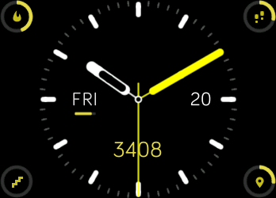

# THE watchface for Fitbit Ionic/Versa/Versa Lite

Features:
- Customize the color of the minute hand and rings
- Tap to cycle between the numerical stats
- Customize which numerical stats are shown
- 4 rings to show steps, distance, calories and floors climbs (becomes active minutes on Versa Lite)
- Battery indicator under the week name
- Direct link to app store (open with phone):
https://gam.fitbit.com/gallery/clock/cc129d5e-ec49-40f0-8f2e-7f5f08ab3095
